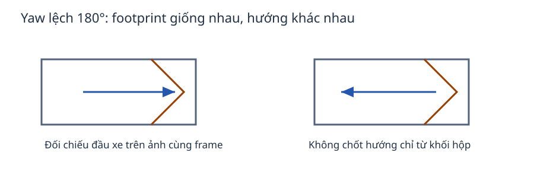
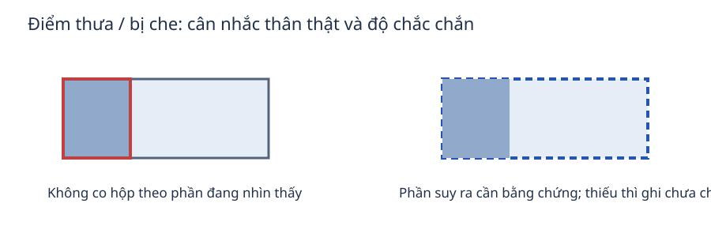
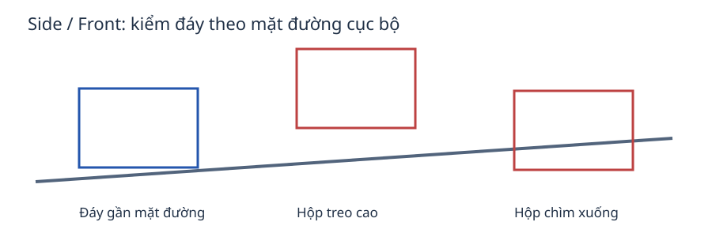

# Ngày 13 — Quy tắc rà cuboid 3D và viết QC

Tài liệu này dùng cho job nguồn trên CVAT và snapshot QC chỉ đọc. Mục tiêu là để người sửa và người QC mô tả cùng một vấn đề bằng bằng chứng quan sát được. Pre-label PointPillars chỉ là gợi ý. Không có ngưỡng kích thước, số điểm, khoảng cách hay điểm model cố định nào tự quyết định một hộp đúng hay sai.

## Chọn class của đối tượng

Schema ca này có năm nhãn cuboid: `vehicles`, `two-wheels`, `pedestrian`, `Animal`, `Obstacle`. Model chỉ tạo pre-label cho `vehicles`, `two-wheels`, `pedestrian`. Bạn vẫn phải tìm, thêm và QC `Animal` và `Obstacle` khi nhận ra đối tượng có cơ sở. Không giữ hộp chỉ vì model vẽ sẵn; không bỏ qua đối tượng chỉ vì model không vẽ.

| Đối tượng xác định được | Class | Điểm cần kiểm |
| --- | --- | --- |
| Ô tô, van, xe tải, xe buýt | `vehicles` | Bao thân xe; xe dài không co thành hộp sedan theo mảng điểm gần |
| Xe máy, xe đạp | `two-wheels` | Phân biệt với người/xe bốn bánh; không giữ class theo model khi ảnh cho thấy khác |
| Người | `pedestrian` | Đừng ghép nhiều người vào một hộp; hướng cần bằng chứng |
| Động vật | `Animal` | Chỉ thêm khi xác định được; model không tạo lớp này |
| Vật cản thuộc schema của ca | `Obstacle` | Không gán mọi cây/cột/mặt đường vào lớp này; trường hợp ngoài taxonomy hỏi coach |

Chọn class theo PCD và ảnh camera của cùng frame. Kiểm lại những trường hợp dễ lẫn như xe hai bánh bị gán `vehicles`. Nếu vùng che khuất khiến class chưa thể phân biệt, ghi “chưa chắc” cùng lý do thay vì đoán. Trong CVAT, sửa class của hộp nguồn rồi **Save**. Trong viewer QC, chọn **Sai class**, ghi ID QC và bằng chứng; không sửa snapshot.

Checkpoint: mỗi hộp giữ lại có class có thể giải thích bằng bằng chứng. Cả năm class đã được cân nhắc khi bạn tự khai rà toàn frame.

## Kiểm hình học qua bốn góc nhìn

Thông số cần kiểm: nhãn; tâm `(x, y, z)`; dài/rộng/cao; hướng và góc xoay. Không hoán đổi dài/rộng rồi giữ nguyên yaw. Một hộp trùng footprint sau khi xoay 180° vẫn có thể sai hướng đầu xe. Trong CVAT, bật **Appearance → Cuboid orientation** khi có để xem hướng; đối chiếu đầu xe trên ảnh cùng frame, không suy hướng chỉ từ chiều dài hộp.

Dùng **Trên**, **Bên**, **Trước** và góc xoay tự do (**Đặt lại** rồi xoay) trước khi kết luận về một cuboid. Góc Trên cho thấy tâm, footprint, hướng và hộp chồng nhau. Góc Bên giúp xem chiều dài, chiều cao và đáy so với mặt đường gần đối tượng. Góc Trước giúp kiểm chiều rộng nhưng có thể chồng các đối tượng ở khoảng cách khác nhau; một hình chiếu Trước không đủ để chốt tâm hoặc chiều dài. Góc xoay tự do cùng ảnh camera giúp kiểm phần che khuất và quan hệ không gian còn mơ hồ.

Chỉnh hộp bao phần thân có cơ sở của đối tượng, kể cả phần bị che khi hình dạng còn suy ra được từ dấu vết đáng tin. Đám điểm thưa không có nghĩa đối tượng nhỏ đi: đừng co hộp sát vài điểm gần nhất. Ngược lại, không dựng hộp cho vùng khuất hoàn toàn nếu không đủ cơ sở xác định đối tượng, class hoặc ranh giới. Khi chưa thể quyết định, ghi rõ điều chưa chắc và đề nghị xem lại.

Đáy hộp nên bám mặt đường **cục bộ** quanh đối tượng. Tọa độ `z = 0` không phải mặt đường chung cho mọi frame/vị trí. Kiểm điểm mặt đường gần hộp ở góc Bên và góc xoay; không dịch đồng loạt hộp theo một con số từ thí nghiệm cũ. Chỉnh hướng khi đầu/thân vật thể đủ rõ. Nếu không phân biệt được đầu xe hoặc hướng người, ghi chưa chắc. Không tạo track ID; mỗi frame/job là một bài riêng.

Checkpoint: hộp không lệch tâm rõ, không ôm cả vùng nền, không co theo điểm thưa; đáy và hướng giải thích được bằng góc nhìn cụ thể. Nếu các góc mâu thuẫn, xem lại trước khi **Save** hoặc gửi QC.

## Tìm hộp thiếu và hộp thừa

Rà toàn frame theo từng vùng thay vì chỉ bấm qua pre-label. Ở mỗi vùng, tìm đối tượng thuộc năm class chưa có hộp, hộp không gắn với đối tượng thật và hộp trùng cho cùng một đối tượng. Ảnh camera cung cấp ngữ cảnh; dùng PCD để kiểm vị trí và hình học 3D khi có thể. PCD trong viewer không có intensity. Màu hoặc độ sáng ảnh camera không phải intensity LiDAR để vạch ranh giới hộp. Viewer có thể lấy mẫu điểm khi hiển thị, nên một vùng trông thưa trên màn hình cần được xem ở nhiều góc.

Với vùng khuất, nhiễu hoặc dữ liệu quá thưa, phân biệt “chưa đủ bằng chứng” với “chắc chắn không có đối tượng”. Không tạo hộp phỏng đoán hay buộc người khác thêm hộp bằng nhận xét khẳng định thiếu cơ sở. Ghi vùng quan sát và phần còn thiếu để tác giả hoặc coach xem lại. Cả nhãn nguồn Robotaxi và prediction đều chưa được phân xử, nên không phải đáp án tự động.

Checkpoint: chỉ chọn **Toàn frame, gồm hộp thiếu/thừa** khi đã tìm cả hai loại lỗi trên toàn frame. Nếu mới kiểm một vùng hoặc vài ID, chọn **Một phần**.

## Viết nhận xét QC có thể xử lý

Viewer QC là snapshot v1 cố định, chỉ đọc. Chọn hộp để lấy ID QC; với đối tượng thiếu chưa có ID, mô tả vùng tọa độ hoặc vị trí tương đối đủ rõ. Mỗi nhận xét trên portal có **Loại lỗi**, **ID QC hoặc vùng tọa độ khi thiếu hộp**, **Bằng chứng/góc nhìn/điều chưa chắc**, **Đề xuất sửa hoặc lý do giữ nguyên**. Các loại lỗi gồm **Sai class**, **Thiếu đối tượng**, **Hộp thừa**, **Vị trí**, **Kích thước**, **Hướng**, **Chưa chắc**, **Không thấy lỗi trong phần đã rà**. Một nhận xét nên nêu một vấn đề kiểm chứng được; dùng **Thêm nhận xét** cho vấn đề khác.

Ví dụ minh họa, không phải frame thật: “ID QC 17; Hướng; góc Trên cho thấy trục dài đúng nhưng đầu xe trong ảnh camera ngược mũi hộp; kiểm lại yaw theo PCD và ảnh trước khi Save.” Với hộp thiếu: “Vùng bên phải cụm hai hộp gần trung tâm frame; Thiếu đối tượng; góc Trên có cụm điểm tách biệt và ảnh camera cho thấy xe hai bánh; kiểm PCD rồi thêm `two-wheels` nếu hình học đủ rõ.” Nếu bằng chứng mơ hồ, dùng **Chưa chắc**, nêu góc nào chưa phân giải được và đề xuất xem lại, không bịa tọa độ hoặc kích thước.

Chọn phạm vi đúng phần đã rà rồi bấm **Nộp toàn bộ feedback**. Tác giả sửa job nguồn trong CVAT, **Save**, rồi nộp v2 và phản hồi. Người QC không sửa hộp trong viewer hoặc CVAT QC. Bốn trường đầy đủ giúp nhận xét xử lý được, nhưng không chứng nhận nhận xét đúng.

Checkpoint: tác giả tìm được đúng hộp/vùng, thấy bằng chứng và biết cần kiểm hoặc sửa gì. Nếu chưa viết được ba điều đó, quan sát thêm hoặc ghi nhận chưa chắc.

## Checklist trước Save / QC

- Đúng class và đúng một hộp cho mỗi đối tượng phân biệt được.
- Tâm, dài/rộng/cao hợp lý theo các góc nhìn; hộp không ôm nền hoặc cụm bên cạnh.
- Hướng đầu xe được kiểm; chưa chắc thì ghi rõ, không đoán theo hướng làn đường.
- Đáy theo mặt đường quanh đối tượng, không mặc định tất cả `z = 0`.
- Đã tìm hộp thiếu/thừa theo phạm vi tự khai; không tự cắt vùng 50 m của Day12 vào bài full-range này.
- Save nguồn trước khi nộp; QC chỉ ghi feedback vào portal.

Cấu trúc này tham khảo [guideline Day12](https://github.com/VinUni-AI20k/K4-L2L3-Day12-Point-Cloud-Cuboid-Student/blob/main/LABEL_GUIDELINE.md); phạm vi và quy trình trên đây dành cho Day13. Không áp dụng số job, vùng crop hoặc rubric của Day12 sang ca này.
